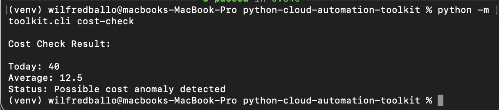
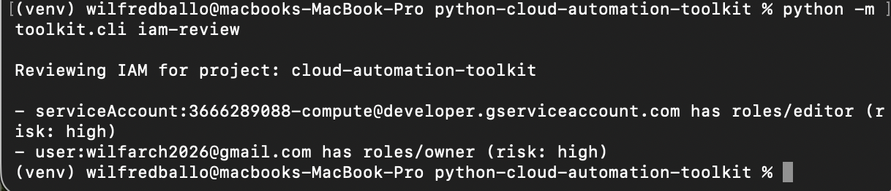

# Python Cloud Automation Toolkit (GCP)

**A Python CLI for surfacing cost anomalies, IAM risks, and unused resources in a GCP project — from the terminal, without opening the console.**

---

## Project Question

How can you give a cloud engineer quick, repeatable visibility into the most common operational problems in a GCP project — cost spikes, overpermissioned accounts, and forgotten resources — using just Python and the command line?

---

## Overview

This toolkit provides four CLI commands that automate common GCP operational checks. Each command targets a different concern: spend anomaly detection, resource inventory, IAM security review, and stale VM identification.

The project uses the Google Cloud Python SDK with argparse for routing. Business logic is fully separated from API calls, so all tests run without credentials or a live project.

---

## How It Works

```
python -m toolkit.cli <command>
        │
        ├── cost-check    loads local billing JSON, flags spend > 1.5× 7-day average
        ├── inventory     queries Compute Engine + Cloud Storage APIs, lists all resources
        ├── iam-review    queries Cloud Resource Manager, flags owner/editor bindings
        └── stale-check   queries Compute Engine, flags TERMINATED instances
```

Each module follows the same pattern:

- a pure function that formats or analyses data — tested without credentials
- a `run_*()` function that handles the env check, API call, and printed output

GCP SDK imports are deferred inside functions. The module can be imported for testing without triggering any network calls or auth checks.

---

## Version 1 Features

| Command | What it checks | Output |
|---|---|---|
| `cost-check` | Today's spend vs rolling average | Flags if spend exceeds 1.5× average |
| `inventory` | VM instances + Cloud Storage buckets | Lists all resources by name, zone, status |
| `iam-review` | Project IAM policy bindings | Flags `roles/owner` and `roles/editor` |
| `stale-check` | TERMINATED VM instances | Lists stopped VMs with zone and reason |

All four commands handle missing credentials, unset environment variables, and permission errors without crashing.

---

## Commands

```bash
# Required for all GCP commands
export GOOGLE_CLOUD_PROJECT=your-project-id
gcloud auth application-default login
```

```bash
python -m toolkit.cli cost-check
python -m toolkit.cli inventory
python -m toolkit.cli iam-review
python -m toolkit.cli stale-check
```

---

## Evidence

### cost-check — anomaly detected

Today's spend is $40 against a 7-day average of $12.50 — flagged as a possible cost anomaly.



---

### iam-review — high-risk roles flagged

Two risky bindings found: a service account holding `roles/editor` and a user account holding `roles/owner`.



---

### inventory — empty project

A clean project with no VMs or buckets. The tool handles this gracefully rather than erroring.


---

## Tests

All 8 tests pass without GCP credentials. Business logic is decoupled from API calls so the test suite runs in under a second.

```bash
python3 -m pytest tests/ -v
```

```
tests/test_cost_check.py::test_detects_anomaly                           PASSED
tests/test_cost_check.py::test_no_anomaly                                PASSED
tests/test_gcp_inventory.py::test_format_inventory_with_resources        PASSED
tests/test_gcp_inventory.py::test_format_inventory_with_no_resources     PASSED
tests/test_iam_review.py::test_find_risky_bindings_detects_owner_and_editor     PASSED
tests/test_iam_review.py::test_find_risky_bindings_returns_empty_for_safe_roles PASSED
tests/test_stale_check.py::test_stale_output_with_findings               PASSED
tests/test_stale_check.py::test_stale_output_empty                       PASSED

8 passed in 0.01s
```

---

## Tech Stack

| | |
|---|---|
| Python 3 | Core language |
| argparse | CLI routing |
| google-cloud-compute | VM inventory and stale-check |
| google-cloud-storage | Bucket listing |
| google-api-python-client | IAM policy queries via Cloud Resource Manager |
| pytest | Unit tests |

---

## Project Structure

```
python-cloud-automation-toolkit/
├── toolkit/
│   ├── cli.py             CLI entry point, routes subcommands
│   ├── cost_check.py      Billing anomaly detection
│   ├── gcp_inventory.py   VM and bucket listing
│   ├── iam_review.py      IAM policy review
│   └── stale_check.py     Stale resource detection
├── tests/
│   ├── test_cost_check.py
│   ├── test_gcp_inventory.py
│   ├── test_iam_review.py
│   └── test_stale_check.py
├── sample_data/
│   └── billing_sample.json
├── docs/evidence/
├── requirements.txt
└── pytest.ini
```

---

## Operational Notes

- `cost-check` reads from `sample_data/billing_sample.json` — a real implementation would pull from BigQuery billing export or the Cloud Monitoring API
- `iam-review` uses Application Default Credentials via `google-api-python-client`
- `inventory` and `stale-check` use the Compute Engine aggregated list API, which queries across all zones in one call
- `Forbidden` errors (insufficient permissions) are caught and reported per command, not as a full crash

---

## Getting Started

```bash
git clone https://github.com/wilfredballo/python-cloud-automation-toolkit.git
cd python-cloud-automation-toolkit
python3 -m venv venv && source venv/bin/activate
pip install -r requirements.txt
export GOOGLE_CLOUD_PROJECT=your-project-id
python -m toolkit.cli inventory
```

---

## Future Improvements

- `--project` flag so `GOOGLE_CLOUD_PROJECT` does not need to be exported separately
- `--output json` for piping results into other tools or scripts
- Pull live billing data from BigQuery billing export instead of a static file
- Extend `stale-check` to flag unused persistent disks and old snapshots
- `--threshold` option on `cost-check` for configurable anomaly sensitivity
- Package as a proper CLI tool with a `pyproject.toml` entry point

---

## Key Takeaways

- Hands-on use of the GCP Python SDK across Compute Engine, Cloud Storage, and IAM APIs
- CLI built with clean module separation — each command is independently runnable and testable
- Pure logic functions tested without credentials — a practical pattern for any SDK-dependent project
- Covers real operational concerns that appear in cloud ops, platform engineering, and support engineering roles: cost visibility, access control, and resource hygiene
